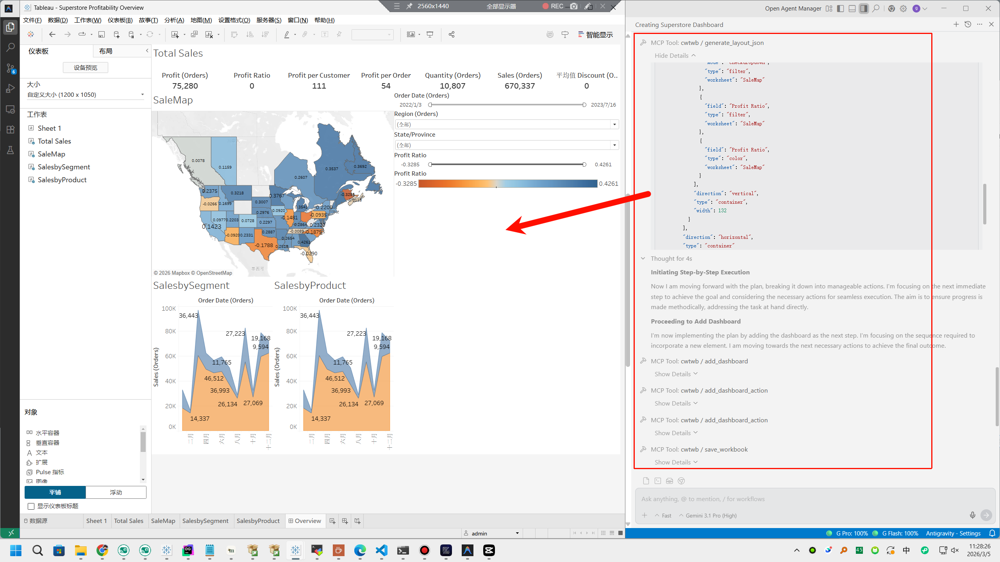
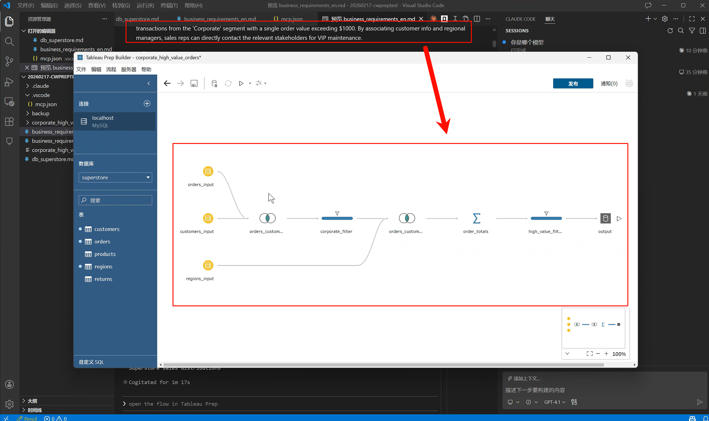
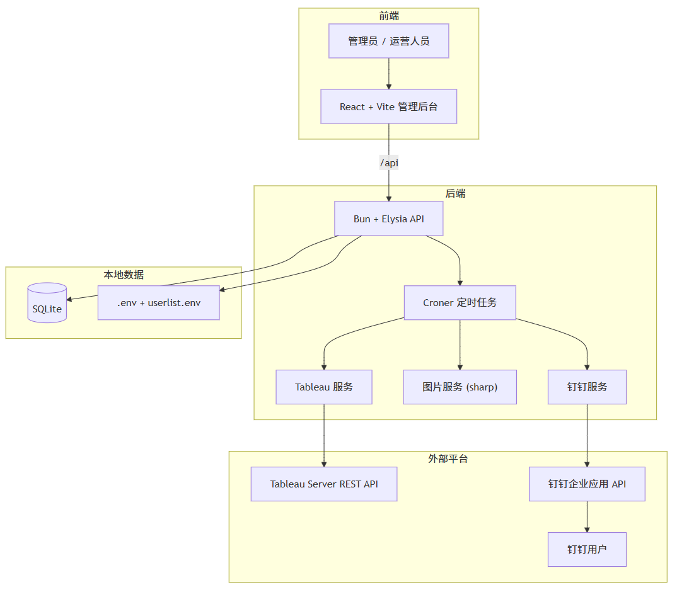
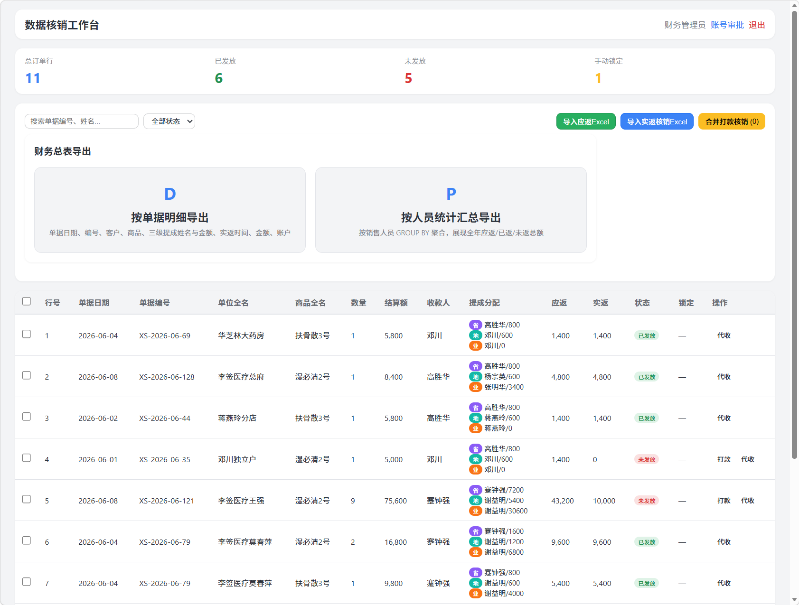
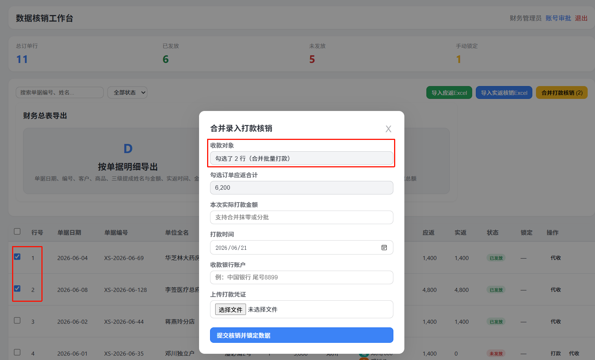
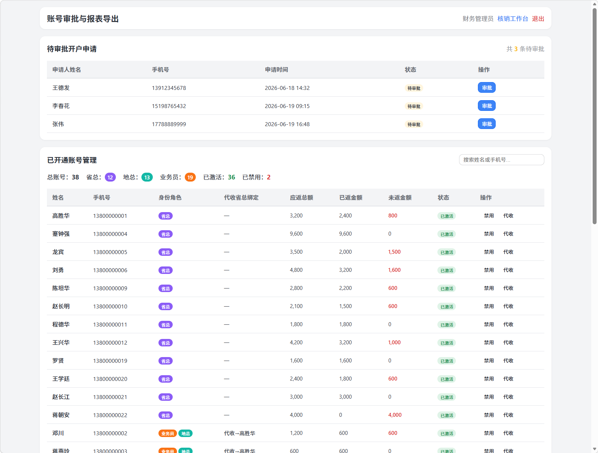
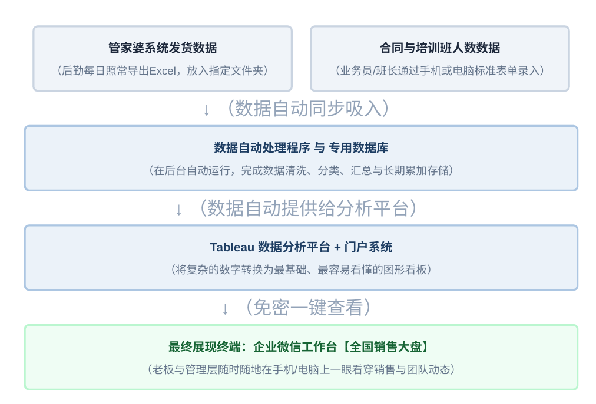
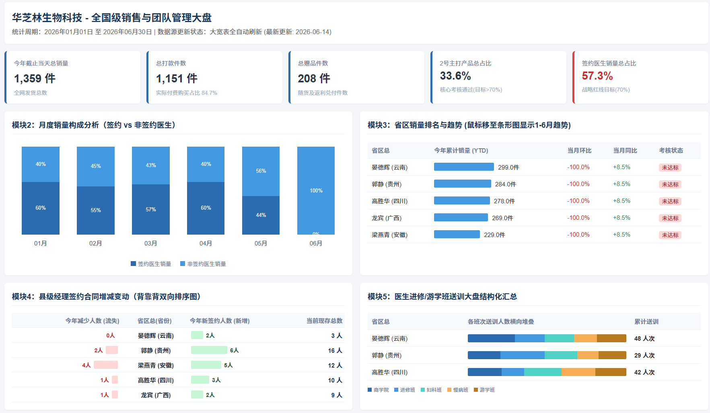

<!-- section: 封面 -->
<!-- center: true -->
### BUSINESS · BI · AI

# 把业务问题，变成 可落地的数据智能方案

**郭文华｜业务型售前顾问 · BI / 数据智能方向**

* 8 年数据与数字化
* 制造 / 消费 / 保险
* AI 原生工作方式

---

<!-- section: 定位 -->
### 个人标签与定位
## 业务、数据与 AI 的连接者

  

    <h2 style="color: #e11d48; margin: 0; font-size: 32px;">8年+</h2>
    
BI与数据解决方案经验

  

  

    <h2 style="color: #e11d48; margin: 0; font-size: 32px;">30+</h2>
    
售前、POC及项目支持经历

  

  

    <h2 style="color: #e11d48; margin: 0; font-size: 32px;">8大</h2>
    
行业覆盖(汽车/制造/金融等)

  

  

    <h2 style="color: #e11d48; margin: 0; font-size: 32px;">3个</h2>
    
开源项目(AI×Tableau×自动化)

  

  

    <h2 style="color: #e11d48; margin: 0; font-size: 32px;">5步</h2>
    
端到端售前(需求—方案—落地)

  

> “不从产品功能开始，而从客户要解决的经营问题开始。”

---

<!-- section: AI+BI -->
### 开源项目 01
## cwtwb：让 AI 工程化构建 Tableau

*从自然语言或代码，生成可检查、可复现、可验证的 `.twb / .twbx`。*

* Python SDK ｜ MCP Server ｜ 图表与仪表板 ｜ XSD 校验 ｜ Cloud 验证 ｜ 可复现交付
* [查看开源项目 ↗](https://github.com/aidatacooper/cwtwb)

---

<!-- section: AI+BI -->
### 开源项目 02
## cwprep：让 AI 构建可复现的数据准备流程

*声明式生成 `.tfl / .tflx`，覆盖连接、清洗、关联、计算、聚合与 SQL 翻译。*

* 多数据源 ｜ Join / Union ｜ 清洗与计算 ｜ Pivot ｜ 打包交付 ｜ SQL Translation
* [查看开源项目 ↗](https://github.com/aidatacooper/cwprep)

---

<!-- section: AI+BI -->
### 开源项目 03
## tableauPushDing：BI 报表定时拼接与钉钉推送系统

*打通 Tableau Server 与企业钉钉生态，实现高清报表自动拉取、长图拼接与定时无感推送。*

* Bun + Elysia ｜ React + Vite ｜ Tableau REST API ｜ sharp 图片拼接 ｜ Croner 调度 ｜ 钉钉工作通知
* [查看开源项目 ↗](https://github.com/imgwho/tableauPushDing)

---

<!-- section: AI产品 -->
### 销售话术分析系统
## 从海量聊天中，提炼可复制的销售能力

| 业务问题 | 产品答案 |
|---|---|
| 优秀销售经验停留在个人手中 | 从真实成交与互动数据筛选样本 |
| 海量企业微信聊天无法人工复盘 | AI 提炼话术、风格与触发条件 |
| 新客转化与客户维系缺少标准资产 | 生成可评分、可复用的话术与聊点库 |

* **HUNTING**：新客开发——首单成交路径、高转化话术
* **FARMING**：客户维系——高互动聊点、SEED+P 话题裂变

---

<!-- section: AI产品 -->
### 数据流转与系统架构
## 从销售聊天记录到可复用话术资产

`ORDER (订单表)` ➔ `STAFF (员工表)` ➔ `BRIDGE (微信映射)` ➔ `CHAT (聊天记录)` ➔ `AI ASSET (AI 话术库)`

#### 真实案例：产品介绍期白酒专家背书 (评分: 85)
* **[上下文]** 销售受邀代表参加发布会，借现场氛围建立稀缺性与品质认可
* **[对话]** 销售：“哥，我现在作为优秀代表跟专家在现场，中科院发酵专业范鏖教授对我们白酒高度评价，价格绝对匹配品质！” ➜ 客户：“好的！我刚到家，等会把定金转过去”
* **[AI 提炼]** ① 权威背书（中科院专家现场好评） ➔ ② 稀缺塑造（上千人仅不到10人受邀） ➔ ③ 价值锚定（回应价格品质匹配）

---

<!-- section: AI产品 -->
### SEED+P 话题裂变模型
## 真实聊天上下文与 AI 自动生成的聊点库

* **01. 地域美食与隐藏宝藏（生活切入）**
  * [背景] 客户出差当地，销售自嘲式请教美食避坑
  * [对话] 销售：“看好多人推荐您老家美食去尝了感觉被‘照骗’，正宗味道怎样？” ➜ 客户：“那些都是网红店噱头，老城区巷子里的才地道！”
  * 💡 **AI 生成聊点走向**：① 避坑共鸣 ➔ ② 谦虚请教 ➔ ③ 延伸老城区宝藏

* **02. 异议化解与真诚沟通（消除顾虑）**
  * [背景] 客户对品牌归属产生怀疑“别是假的吧”
  * [对话] 销售：“怎么会假呢，这是酒厂资质... 有顾虑完全理解，知无不言！” ➜ 客户：“行，了解清楚我就放心了！”
  * 💡 **AI 生成聊点走向**：① 共情资金安全 ➔ ② 出示官方凭证 ➔ ③ 引导开诚布公

* **03. 促成方案与阶段付款（促成交易）**
  * [背景] 客户资金一时周转不开面临观望
  * [对话] 销售：“先收您一万定金，剩下付给快递，假一罚十不让你吃亏！” ➜ 客户：“我当放心你了，明天就把定金转过去。”
  * 💡 **AI 生成聊点走向**：① 降低首付门槛 ➔ ② 货到付款担保 ➔ ③ 正品兜底承诺

---

<!-- section: AI产品 -->
### 20251215-chat-analysis 聊点资产全景
## 海量微信记录中自动提炼的 8 大高互动聊点库

* **01. 早餐习惯 (1588.5)** — “在吃包子奶茶呢，你也别忘了先吃点在工作” ➔ *AI开场：早上好，吃早餐了吗？*
* **02. 体育看球 (1384.5)** — “大叔看球赛吗？我不喜欢看中超！收拾下家里” ➔ *AI开场：你平时喜欢看哪个联赛？*
* **03. 送发票外勤 (1206.5)** — “刚看完你发的文件到公司，等会去别的公司送发票” ➔ *AI开场：早呀，今天要去送发票吗？*
* **04. 阳光与气温 (798.5)** — “难得几天出太阳，阳光明媚像你一样心情美美哒” ➔ *AI开场：今天你们那边出太阳了吗？*
* **05. 流感提醒 (783.0)** — “公司好多同事流感了... 月初欠费很正常” ➔ *AI开场：最近流感挺多的，防护做好没？*
* **06. 酒口味偏好 (704.5)** — “我知道你那都是酱香的，平时我只喝啤酒，白的辣” ➔ *AI开场：平时喝啤酒多，白酒喝得少吧？*
* **07. 地方胡辣汤 (659.5)** — “贵州没正宗胡辣汤！去苏州站坐大巴到了报平安” ➔ *AI开场：当地有什么特色早餐推荐吗？*
* **08. 周一加班 (646.5)** — “早上好勤劳的小蜜蜂，昨天加班到几点呀？” ➔ *AI开场：昨天加班到几点？目标完成没？*

---

<!-- section: 华芝林 -->
### 华芝林 · 个人售前项目
## 客户给我的，不是一份完整需求

* 管家婆发货数据 ｜ 20+ 省区经营监控 ｜ 70% 签约红线
* 合同与培训人数 ｜ 应返 / 实返 ｜ 省总 / 地总 / 业务
* 兼任与代收 ｜ 一单多商品 ｜ 企业微信入口

> “真正的售前工作，是把这些碎片重新组织成**客户能够确认、团队能够交付**的系统。”

---

<!-- section: 华芝林 -->
### 流程与范围控制
## 把返款业务拆成两个可追溯工作流

* **WORKFLOW A: 应返**（订单明细 → 角色分配 → 应返金额 → 销售查询）➜ *回答：这笔钱为什么属于我？*
* **WORKFLOW B: 实返**（财务汇总打款 → 实返 Excel → 批次核销 → 到账核对）➜ *回答：这次到账包含哪些订单？*

**交付规范**：联合主键(单据编号+商品) ｜ 已核销数据锁定 ｜ 代收关系动态配置 ｜ 多身份视角切换 ｜ 一期锁定返款核销

---

<!-- section: 华芝林 -->
### 原型证据
## 用可点击原型，把口头规则变成共同语言

---

<!-- section: 华芝林 -->
### 方案与看板证据
## 从数据源到管理动作的完整链路

* 保留员工 Excel 工作习惯 ｜ 后台清洗、分类与沉淀 ｜ 70% 红线识别经营偏差 ｜ 企业微信免密入口

---

<!-- section: 行业案例 -->
### 案例组合
## 制造为主，消费与保险补充

* **一汽 / 一汽大众**：产销存、供应链、财务经营、HR、管理层会议 BI （*制造 · 复杂业务*）
* **立白 / 蒙牛 / 华芝林**：电商全链路、财务 PoC、销售与返款数智化（*消费 · 零售*）
* **友邦 / 安盛天平**：销售业绩、佣金、保费、经营监控与异常识别（*保险 · 经营分析*）
* **金科 / 广汽研究院**：招投标、产品边界、平台升级、多端与权限方案（*复杂售前 · 推进*）

---

<!-- section: 岗位价值 -->
### 岗位匹配
## 业务型售前 × AI 原生执行力

1. **更快进入业务**：快速理解陌生流程，抓住管理问题与关键规则
2. **更清楚地讲价值**：用指标、场景和决策路径，而不是功能清单沟通
3. **更快形成验证**：借助 AI 生成原型、样例和可运行的 BI 资产
4. **更稳地推进项目**：明确角色、范围、风险、交付物与关键节点

> “岗位需要的不是‘会讲 BI’，而是能把客户经营诉求转成可信方案的人。”

---

<!-- section: 结束 -->
<!-- center: true -->
### LET'S BUILD VALUE WITH DATA

# 把客户听不清的需求 变成 看得见、能验证、可落地 的方案

**郭文华｜成都｜业务型售前顾问 · BI / 数据智能**

[173 1316 2175](tel:17313162175) ｜ [imgwho@qq.com](mailto:imgwho@qq.com) ｜ [github.com/aidatacooper ↗](https://github.com/aidatacooper)
