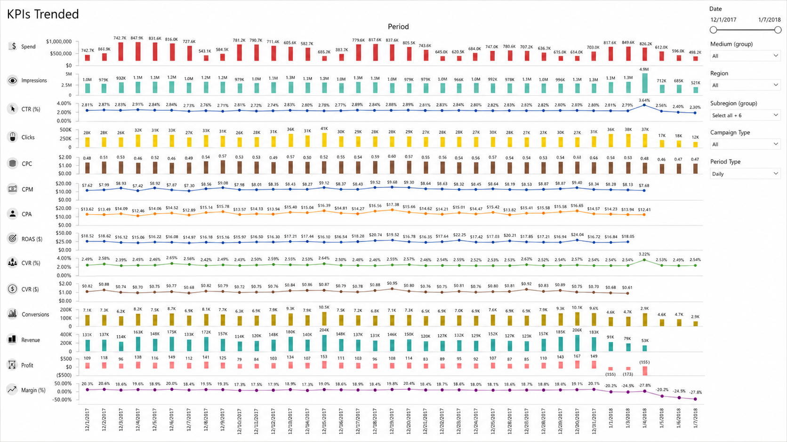
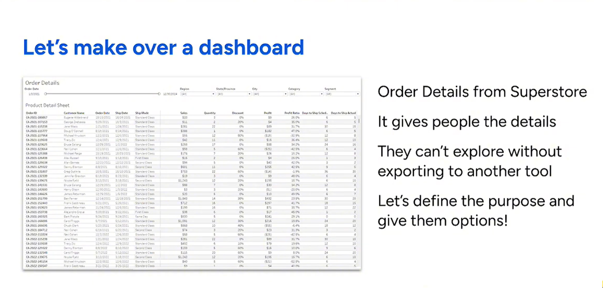
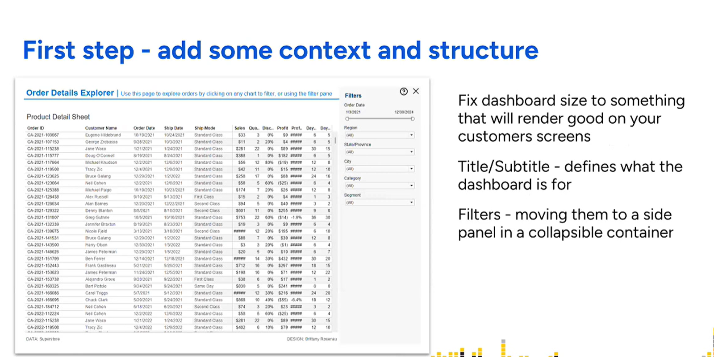
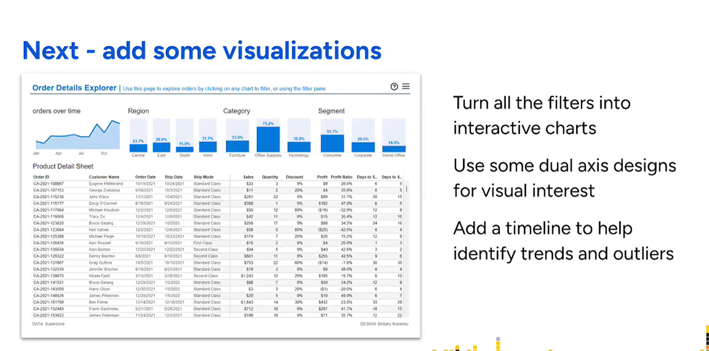
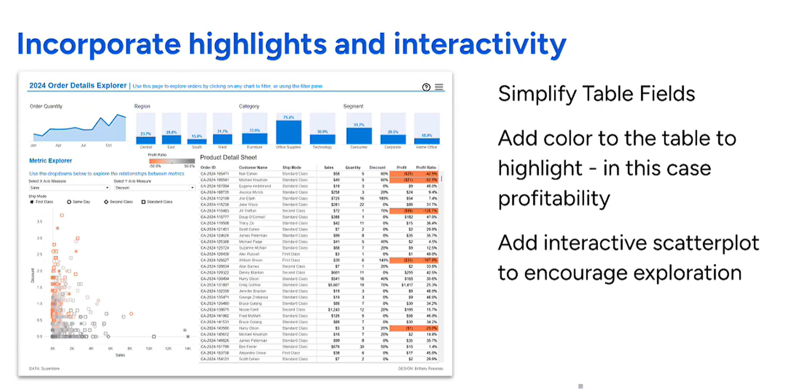
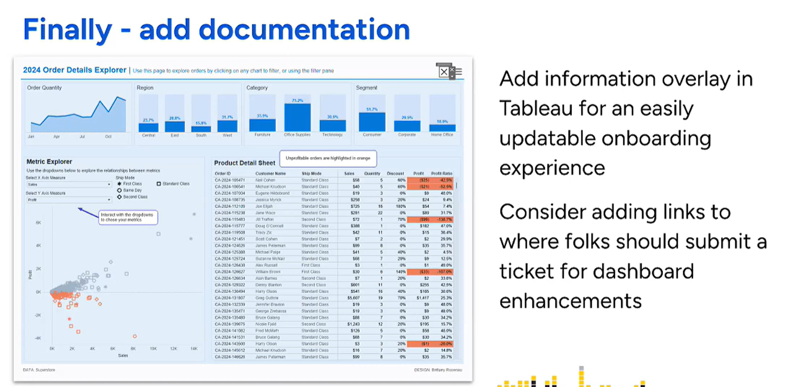

# 资深BI工程师：AI+BI的最佳实践

从“一堆图”到可行动的数据产品

---

# 目录

1. 为什么很多 BI 最终变成“一堆图”
2. BI 开发：如何从图表走向产品
3. Html、多维表、传统 BI 对比
4. 重构 BI：AI+BI 的思路
5. 案例：Codex 一键打通 BI
6. BI 扩展：副业与接单

---

# 1. 需求停在“展示层”

典型需求：

- 做个看板
- 做个大屏
- 做个仪表盘

这些词都指向“展示”，而不是“业务目标”。

**结果：图很漂亮，但业务不知道该怎么用。**

---

# 2. 指标是堆出来的

- 数据库里有什么字段就展示什么
- 趋势图、饼图、柱状图堆满一屏
- 缺少核心指标、解释指标、行动指标

**没有指标体系，图表只能是数据截图的高级版。**

---

# 3. 没有决策场景

- 浏览场景：看看数据怎么样
- 决策场景：今天要做什么动作？预算调哪里？哪个产品要下架？

**没有决策场景，BI 就无法驱动行动，只能成为数据橱窗。**

---

# 4. BI 被当成汇报工具

- 汇报：要好看、要炫、要动效
- 运营：要定位问题、要指导动作、要融入流程

**汇报型 BI = 好看但不长久**

**运营型 BI = 好用才会被持续使用**

---

# 5. 缺少闭环

- 看完数据没有下一步动作
- 没有责任人
- 没有阈值
- 没有预警
- 没有行动建议

**没有闭环的 BI，本质上就是“一堆图”。**

---

# 6. 反面案例：指标很多，但判断很少

- 每个 KPI 都被铺开，但没有优先级
- 用户需要自己判断哪里异常
- 缺少“先看什么、异常是什么、下一步做什么”的路径

**坏 BI 的典型特征：信息很满，但决策很空。**

<!-- 注释：这页用来说明，问题不是图表少，而是信息没有被组织成决策路径。 -->

---

# 7. 从图表到场景化看板

**核心：图表不再是数据的形状，而是问题的答案。**

- 先写业务问题，再画图
- 每张图都对应一个明确的问题
- 看板结构围绕“场景”而不是“图表类型”

**场景化让 BI 从展示走向理解。**

---

# 8. 从看板到决策工具

**核心：BI 不只是告诉你发生了什么，还要推动你做什么。**

加入三个关键能力：

- 阈值：好/坏的分界线
- 预警：自动发现异常
- 动作入口：预算调整、配置修改、任务派发

**决策工具让 BI 从理解走向行动。**

---

# 9. 从决策工具到数据产品

**核心：让 BI 能被复用、被售卖、被迭代。**

数据产品具备：

- 明确的用户角色
- 清晰的价值主张
- 完整的功能结构
- 权限体系、配置体系、数据源管理

**数据产品让 BI 从行动走向规模化价值。**

---

# 10. 案例：明细表不是数据产品

- 只有订单明细，用户知道“有什么数据”，但不知道“该看什么”
- 探索路径依赖导出到其他工具，BI 没有承接分析动作
- 这就是“一堆图 / 一张大表”的典型状态

<!-- 注释：这里不要先讲美化，先指出原始看板的问题是缺少目的、路径和动作。 -->

---

# 11. 第一步：补上下文和结构

- 固定尺寸，保证交付体验稳定
- 标题和副标题定义业务语境
- 筛选器移到侧边栏，为分析区域腾出空间

<!-- 注释：这一步对应“场景化看板”，先让用户知道这个页面服务哪个场景。 -->

---

# 12. 第二步：把筛选变成分析入口

- 把筛选器转成可点击图表
- 增加趋势，帮助用户识别时间变化
- 增加维度图表，帮助用户定位区域、品类、客群差异

<!-- 注释：强调筛选不是控件堆叠，而是探索路径的一部分。 -->

---

# 13. 第三步：加入高亮和交互探索

- 简化表格字段，降低阅读负担
- 用颜色高亮盈利能力
- 加入散点图，鼓励用户探索异常和关系

<!-- 注释：这一步对应“决策工具”，让用户看到问题并继续追问。 -->

---

# 14. 最后：补文档、入口和闭环

- 说明浮层降低新用户上手成本
- 可以加入反馈、工单或改进需求入口
- 这不是单纯美化，而是把看板补成可持续迭代的数据产品

**好的 BI 不是把数据摆出来，而是把用户带到下一步动作。**

<!-- 注释：用这页收束案例，连接后面的 AI+BI：AI 应该自动化这种产品化改造，而不是只生成图表。 -->

---

# 15. Html、多维表、传统 BI 对比

| 评估维度 | HTML 自研方案 | 多维表 | 传统 BI |
| --- | --- | --- | --- |
| 定制化能力 | 极高 | 较低 | 较高 |
| AI 自动生成友好度 | 极高 | 一般 | 较低 |
| 数据量支持 | 取决于架构 | 较小 | 极高 |
| 维护成本 | 高 | 极低 | 中等 |
| 适用场景 | 高定制看板 | 轻量协作 | 企业核心分析 |

---

# 16. 重构 BI：从 GUI 到声明式代码

- AI 将业务需求转为配置文件或代码脚本
- 代码定义数据清洗流，AI 映射字段并处理缺失值
- Python 解析 XML / JSON，批量组装报表与布局

---

# 17. AI Agent 在 BI 中的闭环

1. 需求理解与规划：解析指标、维度与图表类型
2. 自动化加工与生成：生成清洗流文件与报表模板
3. 部署与校验：上传报表并校验数据准确性

---

# 18. Tableau 自动化配置方法

## imgwho/cwprep + imgwho/cwtwb

- cwprep：https://github.com/imgwho/cwprep
- cwtwb：https://github.com/imgwho/cwtwb
- 安装工具：`pip install cwprep cwtwb`
- 配置 MCP：在客户端注册 `uvx cwprep` 和 `uvx cwtwb`
- 本地自检：运行 `cwprep doctor`、`cwprep status`、`cwtwb doctor`、`cwtwb status --json`
- 分工边界：cwprep 生成 `.tfl/.tflx` 清洗流；cwtwb 生成、编辑、校验 `.twb/.twbx` 工作簿

---

# 19. Tableau 落地步骤

1. 准备数据清洗流：用 cwprep 读取 API、计算语法、最佳实践，设计 flow definition
2. 生成 Prep 文件：先 `validate_flow_definition`，再用 `generate_tfl` 输出 `.tfl/.tflx`
3. 准备工作簿模板：用 cwtwb `create_workbook` 或 `open_workbook`，设置数据源
4. 组装报表：`list_fields`、`add_worksheet`、`configure_chart`、`add_dashboard`、`save_workbook`
5. 校验与分发：用 `cwtwb validate` 或云端 REST 校验，再接 `tableauPushDing` 截图推送

---

# 20. Tableau 实操演示

- `Videos/1tableau 配置mcp_compressed.mp4`
- `Videos/2tableau 询问mcp能力_compressed.mp4`
- `Videos/3tableau生成成功_compressed.mp4`

线上 HTML 版本提供可切换视频与倍速播放控件。

---

# 21. Power BI 智能体配置方法

## PowerBI Authoring Skills + Modeling MCP

- MCP：https://github.com/microsoft/powerbi-modeling-mcp
- Skill：https://github.com/microsoft/skills-for-fabric/blob/main/plugins/powerbi-authoring/skills/powerbi-report-authoring/SKILL.md
- 安装 Skills：下载 PowerBI Authoring Skills，放入 `.agents/skills` 或 `~/.agents/skills`
- 安装 MCP：配置 PowerBI Modeling MCP，让 AI 读取模型、创建度量值、运行 DAX 查询和导出元数据
- 安装依赖：准备 Node.js 20+，安装 `@microsoft/powerbi-report-authoring-cli` 与 `@microsoft/powerbi-desktop-bridge-cli`
- 验证环境：运行 `powerbi-report-author --version` 和 `powerbi-desktop --version`

---

# 22. Power BI 落地步骤

1. 方式 A：基于已打开模型，先打开 Power BI Desktop 并导入数据，让 AI 读取当前模型并设计报表
2. 方式 B：基于 PBIP 项目，将现有报表导出为 PBIP；编辑或美化时保持 PBIP 文件关闭
3. Prompt 发起需求：说明页数、分析主题、布局风格和覆盖场景
4. 先审设计文档：AI 产出 `_brief/report-spec.md`，确认后回复 approve
5. 生成与验收：打开 AI 产出的 PBIP 刷新数据，需要交付时另存为 `.pbix`

---

# 23. Power BI 实操演示

- `Videos/1powerbi 配置mcp skill npm_compressed.mp4`
- `Videos/2powerbi生成成功_compressed.mp4`

线上 HTML 版本提供可切换视频与倍速播放控件。

---

# 24. BI 扩展：小红书

- 定位：数据分析专家、BI 自动化效率专家
- 展示：HTML 仪表盘截图、Tableau / Power BI 模板
- 实操：AI+BI 自动化提效案例
- 转化：引流至微信私域，承接定制、咨询、简历指导

---

# 25. 小红书案例：搜索需求已经存在

- 搜索词明确：powerbi 代做、财务报表、会计、期末作业
- 内容应展示案例、价格区间和交付物
- 转化动作导向私信咨询、需求表单或微信私域

<!-- 注释：这页说明小红书更适合内容引流，用需求词反推选题和封面。 -->

---

# 26. BI 扩展：闲鱼

- 成品模板：销售、财务、行业标准看板
- 定制服务：Tableau / Power BI、Python 清洗脚本、Excel 自动报表
- 关键词：数据分析、BI代做、报表定制、大屏设计、DAX编写
- 高效交付：复用模板库与 AI 工具，提高单小时利润率

---

# 结论

AI+BI 的关键不是让 AI 帮你拖图表。

真正的变化是：把 BI 改造成可规划、可生成、可校验、可部署的数据产品工程。
